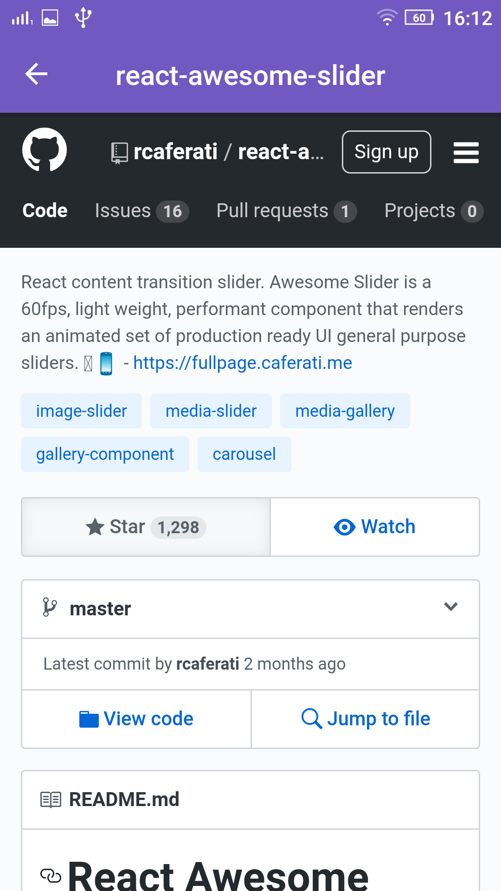

# App Github Stars

Neste app vc adiciona usuários do Github. Ao ver o perfil do usuário, vc vê
todos os repositórios favoritados com star deste usuário. Ao clicar no
repositório, abre a própria página web do Github do repositório.

- Instale as dependências: `yarn`
- Rode o bundle: `yarn start`
- Se tiver com o reactotron: `yarn reactotron`
- Rode no android: `yarn android`
